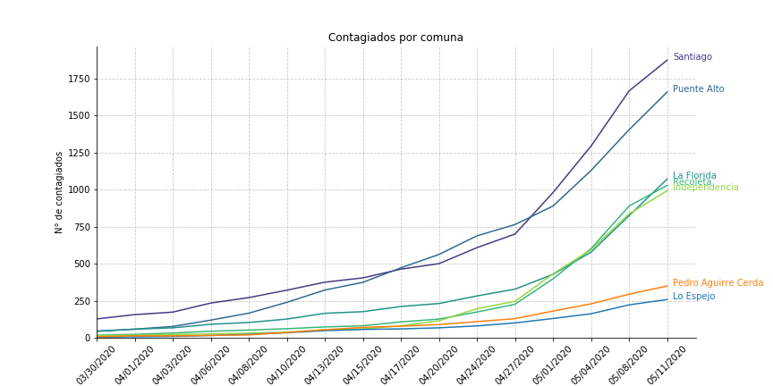
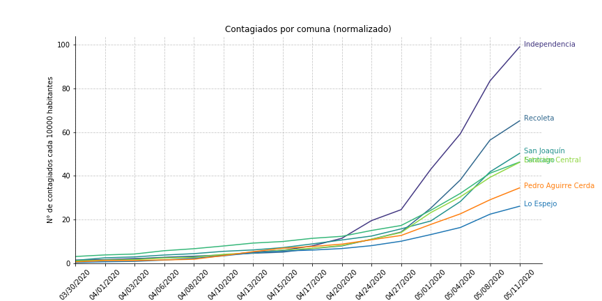

# covid19-comuna
Estadisticas por comunas de cada región de Chile

Los datos son obtenidos desde https://github.com/jorgeperezrojas/covid19-data/, quien actualiza los datos según los informes epidemiológicos del MINSAL.
Los mapas son sacados de https://github.com/carnby/uddvis, mapas provenientes del Censo 2017

Por ahora se tienen resultados para la Región Metropolitana, los cuales se encuentran en el notebook `confirmados_RM.ipynb` y en la carpeta `output_RM`. El notebook crea dos animaciones .gif sobre un mapa de la región usando los datos en raw y normalizados por la poblacion de cada comuna por cada 10000 habitantes. En el caso de la RM se tienen las siguientes animaciones (clic para verlas en detalle):

En cuanto a gráficos de linea, dentro del notebook se plotea el top 5 + dos comunas a elección (en este caso Lo Espejo y PAC):

La idea es crear gráficos similares para cada región, el notebook `confirmados_RM.ipynb` contiene el código suficiente para extrapolar los resultados a las demás regiones del país.
